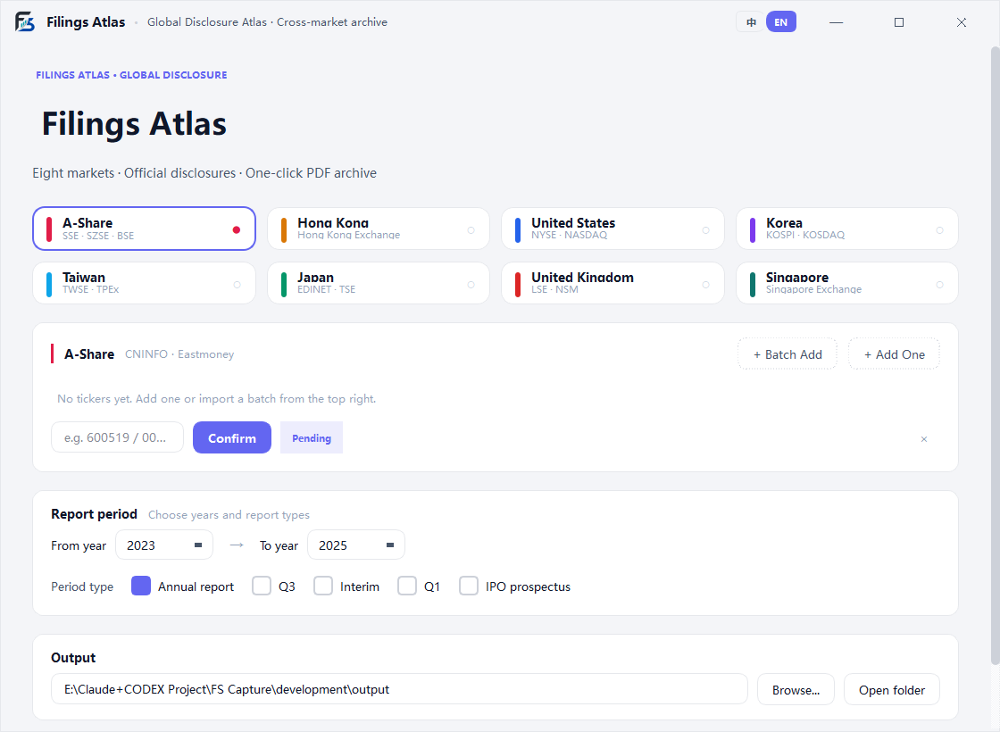
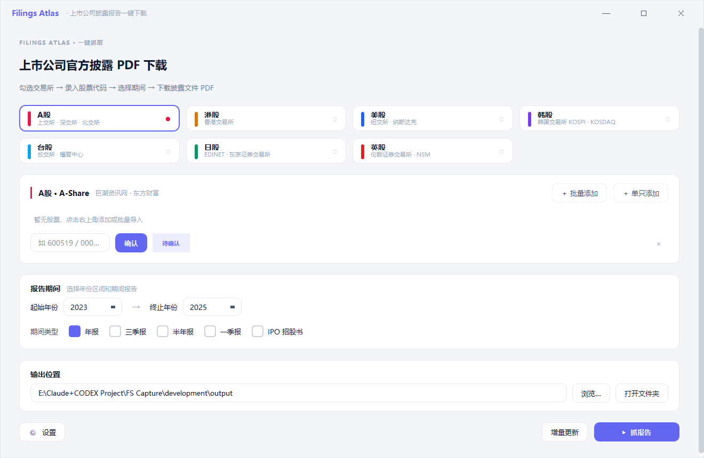

# Filings Atlas / 全球披露图谱

[English](#english) | [中文](#chinese)

---

## English

Filings Atlas is a Windows desktop tool for one-click downloading of official disclosure PDFs across 8 markets. It focuses on the original filing files only: no financial statement extraction, no ratio calculation, and no Excel workbook generation.

### Supported Markets

| Market | Source | Reports | Key required |
|---|---|---|---|
| A-Share | CNINFO + akshare | Annual, Q1, Interim, Q3, IPO prospectus | No |
| Hong Kong | HKEXnews + Eastmoney | Annual, audit report, IPO prospectus | No |
| United States | SEC EDGAR | Annual, quarterly, IPO prospectus | No |
| Korea | DART | Annual, Q1, Interim, Q3 | Optional DART API key |
| Taiwan | TWSE + MOPS | Annual, Q1, Interim, Q3, IPO prospectus | No |
| Japan | EDINET | Annual, Q1, Interim, Q3 | No (key optional, accelerates) |
| United Kingdom | FCA NSM | Annual, interim and trading updates where available | No |
| Singapore | SGXNet | Annual, interim, IPO prospectus | No |

### Quick Start

1. Download the Windows release package and extract it to any writable location.
2. Keep `Filings Atlas.exe` and the `_internal/` folder together.
3. Double-click `Filings Atlas.exe`.
4. Select one or more markets, enter ticker codes, and click **Confirm** to resolve company names.
5. Choose years and report types, then click **Download Reports**.
6. PDFs are saved flat under `output/` with names like `UK_ULVR_Unilever PLC_2024_年报.pdf`.

### Ticker Examples

| Market | Examples |
|---|---|
| A-Share | `600519`, `000001` |
| Hong Kong | `00700`, `09988` |
| United States | `AAPL`, `BRK.B` |
| Korea | `005930`, `000660` |
| Taiwan | `2330`, `2317` |
| Japan | `7203`, `6758`, `9984.T` |
| United Kingdom | `ULVR`, `HSBA.L`, `AZN` |
| Singapore | `D05`, `U11`, `Z74`, `D05.SI` |

### Optional Keys

Korea works without a key by using the public DART disclosure pages. Adding a free DART API key in **Settings** can make Korea faster and more stable.

Japan works without a key through the EDINET public web search. Adding a free EDINET Subscription-Key in **Settings** switches Japan to the official API path, which has a higher default rate limit (`edinet = 2.0` vs `edinet_web = 1.0`) and can be faster for larger batches. Register through [EDINET](https://disclosure2.edinet-fsa.go.jp/) / [EDINET API key registration](https://api.edinet-fsa.go.jp/api/auth/index.aspx) if you want the accelerator.

United Kingdom uses the FCA National Storage Mechanism and does not require a key.

Singapore uses SGXNet public disclosure APIs plus SGX attachment pages and does not require a key.

### Privacy And Scope

- Uses public disclosure endpoints only.
- Does not bypass login, scrape private data, or access unauthorized systems.
- Keeps API keys, cache, sidecars and downloaded files on your local machine.
- Does not provide investment advice or trading functionality.

### Developer Notes

- Source code lives under `development/`.
- Architecture and extension guide: [ARCHITECTURE.md](ARCHITECTURE.md).
- Tests: `cd development && python -m pytest -m "not e2e" -v`.

---

## Chinese

Filings Atlas / 全球披露图谱 是一个 Windows 桌面工具，用于一键下载 8 个市场上市公司的官方披露 PDF。工具只解决“批量拿到原始披露文件”这一件事：不抓三大报表数字、不算财务指标、不生成 Excel 底稿。

### 支持市场

| 市场 | 数据源 | 报告类型 | 是否需要 Key |
|---|---|---|---|
| A 股 | 巨潮资讯 + akshare | 年报、一季报、半年报、三季报、IPO 招股书 | 不需要 |
| 港股 | 披露易 + 东方财富 | 年报、审计报告、IPO 招股书 | 不需要 |
| 美股 | SEC EDGAR | 年报、季报、IPO 招股书 | 不需要 |
| 韩股 | DART | 年报、一季报、半年报、三季报 | DART API Key 可选 |
| 台股 | TWSE + MOPS | 年报、一季报、半年报、三季报、IPO 公开说明书 | 不需要 |
| 日股 | EDINET | 年报、一季报、半年报、三季报 | 不需要（Key 可选，加速） |
| 英股 | FCA NSM | 年报、半年报及可用的交易更新 | 不需要 |
| 新加坡 | SGXNet | 年报、半年报、IPO 招股书 | 不需要 |

### 快速开始

1. 下载 Windows 发布包，并解压到任意可写位置。
2. 保持 `Filings Atlas.exe` 与 `_internal/` 文件夹在同一目录。
3. 双击 `Filings Atlas.exe`。
4. 勾选市场，输入股票代码，点击“确认”识别公司名称。
5. 选择年份和报告类型，点击“抓报告”。
6. PDF 会平铺保存到 `output/`，文件名示例：`UK_ULVR_Unilever PLC_2024_年报.pdf`。

### 股票代码示例

| 市场 | 示例 |
|---|---|
| A 股 | `600519`, `000001` |
| 港股 | `00700`, `09988` |
| 美股 | `AAPL`, `BRK.B` |
| 韩股 | `005930`, `000660` |
| 台股 | `2330`, `2317` |
| 日股 | `7203`, `6758`, `9984.T` |
| 英股 | `ULVR`, `HSBA.L`, `AZN` |
| 新加坡 | `D05`, `U11`, `Z74`, `D05.SI` |

### Key 配置

韩股不填 Key 也可以使用 DART 公网披露页；如需更快、更稳，可在设置中填入免费的 DART API Key。

日股不填 Key 也可以使用 EDINET 公网搜索页下载报告；如需批量任务更快，可在设置中填入免费的 EDINET Subscription-Key，切换到官方 API 路径（默认限流 `edinet = 2.0`，公网路径 `edinet_web = 1.0`）。可通过 [EDINET](https://disclosure2.edinet-fsa.go.jp/) / [EDINET API Key 注册页](https://api.edinet-fsa.go.jp/api/auth/index.aspx) 免费注册并申请 Key。

英股使用 FCA National Storage Mechanism 公网数据源，不需要 Key。

新加坡市场使用 SGXNet 公网披露 API 与 SGX 附件页面，不需要 Key。

### 隐私与范围

- 只访问公开披露接口。
- 不绕过登录，不抓取私人数据，不访问未授权系统。
- API Key、缓存、sidecar 元数据和下载文件都只保存在本机。
- 不做交易、不抓实时行情、不提供投资建议。

### 开发者文档

- 源码目录：`development/`
- 架构与“如何加新市场”：[`ARCHITECTURE.md`](ARCHITECTURE.md)
- 测试命令：`cd development && python -m pytest -m "not e2e" -v`

## License

[MIT License](LICENSE) © 2026 Eric Zhang
