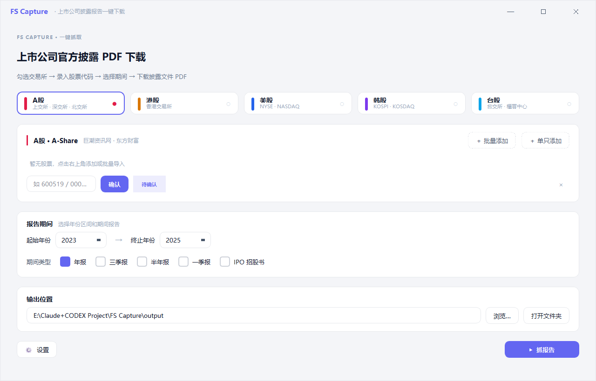

# Filings Atlas / 全球披露图谱

> 一键批量下载 A 股 / 港股 / 美股 / 韩股 / 台股上市公司的官方披露文件（年报 / 审计报告 / 季报 / 半年报 / IPO 招股书）。
>
> 当前版本：v0.6.1

Filings Atlas / 全球披露图谱 是一个 Windows 桌面工具，专注解决「批量拿到原始 PDF」这一件事——**不抓三大报表数字、不算财务指标、不生成 Excel 底稿**。需要财务数据 / Excel 装填的场景请使用相关 VBA 工具。

---

## What's new in v0.6.1

v0.6.1 修复了限流设置热更新、港股年报选片校验、非 12 月财年港股覆盖、A 股代码表脏数据诊断、韩股行业字段读取和批量导入失败行反馈等问题。

---

## 下载

前往 **[Releases 页面](https://github.com/Eric-KY-Zhang/FS-Capture/releases/latest)** 下载最新版：

1. 点击 `FS-Capture-vX.X-windows.zip` 下载
2. 解压到任意文件夹
3. 双击 `Filings Atlas.exe` 运行

> 无需安装 Python，无需联网激活，解压即用。

---

## 支持的市场与报告类型

| 市场 | 报告类型 | 是否需要账号 |
|---|---|---|
| 🇨🇳 A 股 | 年报、一季报、半年报、三季报、IPO 招股书 | 不需要 |
| 🇭🇰 港股 | 年报、独立审计报告、IPO 招股书 | 不需要 |
| 🇺🇸 美股 | 年报（10-K）、季报（10-Q）、IPO 招股书（S-1） | 不需要 |
| 🇰🇷 韩股 | 年报、季报、半年报 | 需要 DART API Key（免费） |
| 🇹🇼 台股 | 年报、季报、半年报、IPO 公开说明书（含上柜） | 不需要 |

---

## 使用步骤

### 第一步：输入股票代码

- 勾选目标交易所（A 股 / 港股 / 美股 / 韩股 / 台股）
- 点击「批量添加」可从 Excel / 网页 / 文本一次粘贴多只股票代码；也可以用「单只添加」逐行录入
  - A 股：`600519`（贵州茅台）
  - 港股：`00700`（腾讯控股）
  - 美股：`AAPL`（苹果）
  - 韩股：`005930`（三星电子）
  - 台股：`2330`（台积电）
- 点击「确认」，工具会自动识别公司名称

### 第二步：选择年份和报告类型

- 拖动年份滑块选择区间（如 2020–2024）
- 勾选需要的报告类型：年报 / 季报 / 半年报 / IPO 招股书

### 第三步：开始抓取

- 点击「开始抓取」
- 进度面板实时显示每个任务的状态
- 下载完成后，PDF 保存在程序同目录下的 `output/` 文件夹

**文件命名格式**：`市场_代码_公司名_年份_报告类型.pdf`
例：`HK_00700_腾讯控股_2024_年报.pdf`

---

## 韩股配置（DART API Key）

下载韩股文件需要免费注册 DART API Key：

1. 前往 [https://opendart.fss.or.kr/](https://opendart.fss.or.kr/) 注册账号
2. 申请 API Key（审核通常当天通过）
3. 打开 Filings Atlas → 点击右上角「设置」→ 粘贴 API Key → 保存

> 暂时没有 Key？不勾选韩股即可，A / 港 / 美 / 台四个市场不受影响。

---

## 常见问题

**Q：下载速度很慢？**
A：工具已内置限速，避免被各交易所封 IP。速度取决于报告数量和网络状况，正常情况下每份 PDF 几秒内完成。

**Q：某个公司没找到？**
A：确认股票代码格式正确（港股需补零至 5 位，如 `00700`）。部分小市值公司在数据源中可能登记信息不全。

**Q：PDF 下载失败 / 文件损坏？**
A：重新点击「开始抓取」，工具会跳过已成功的文件，只重试失败项。

**Q：程序打开报"Windows 已保护你的电脑"？**
A：点击「更多信息」→「仍要运行」。这是 Windows SmartScreen 对未签名 EXE 的默认提示，工具本身不含恶意代码（[MIT 开源](LICENSE)）。

---

## 隐私与合规

- 所有请求均为公开接口的 GET / POST，不绕过登录，不抓取私人数据
- SEC（美股）请求自带邮箱 User-Agent，符合 SEC fair-use 政策
- DART API Key 和所有下载文件仅保存在本地，不上传任何数据
- 不做交易，不抓实时行情

---

## 开发者文档

- [`ARCHITECTURE.md`](ARCHITECTURE.md) — 项目架构与模块设计
- [`development/`](development/) — 源码（Python 3.11 + PySide6）

## 许可

[MIT License](LICENSE) © 2026 Eric Zhang
