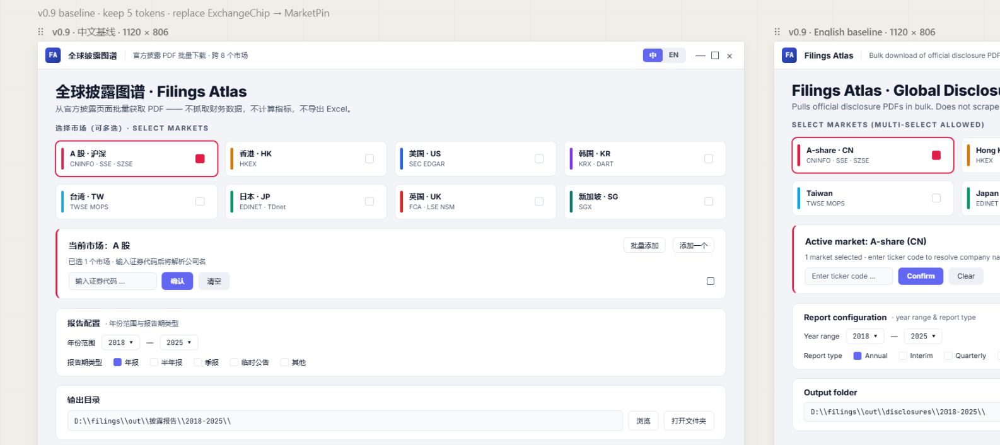
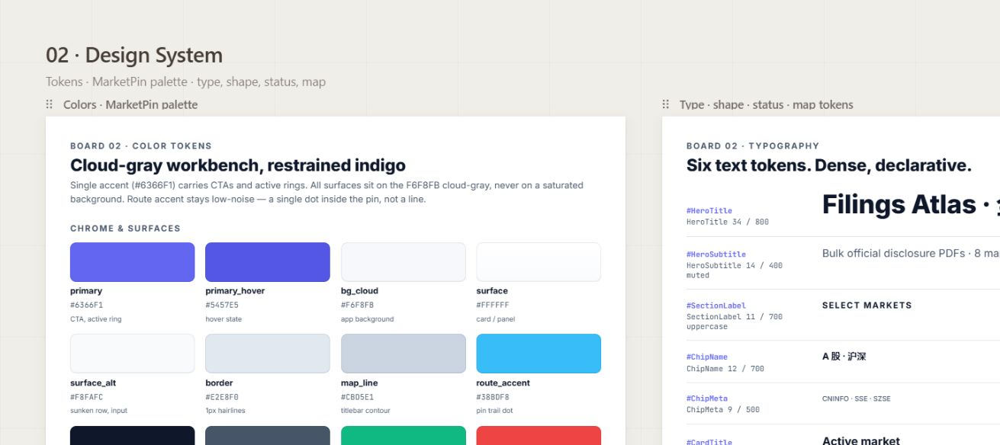
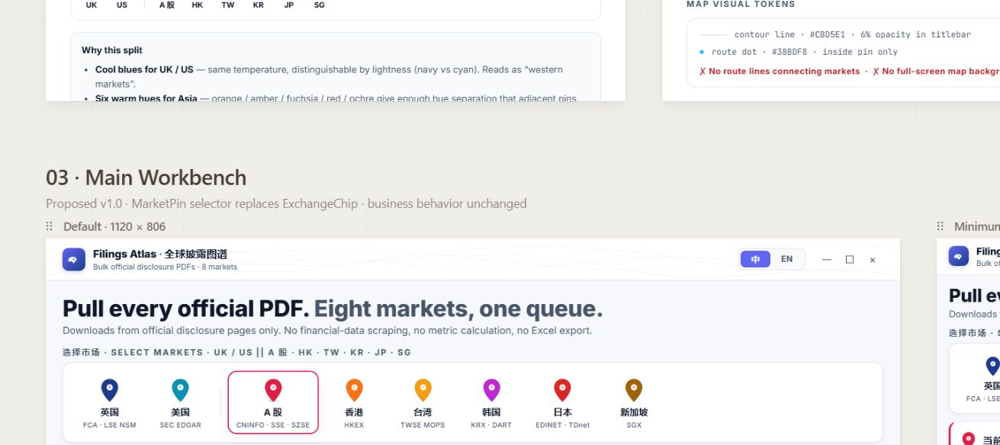
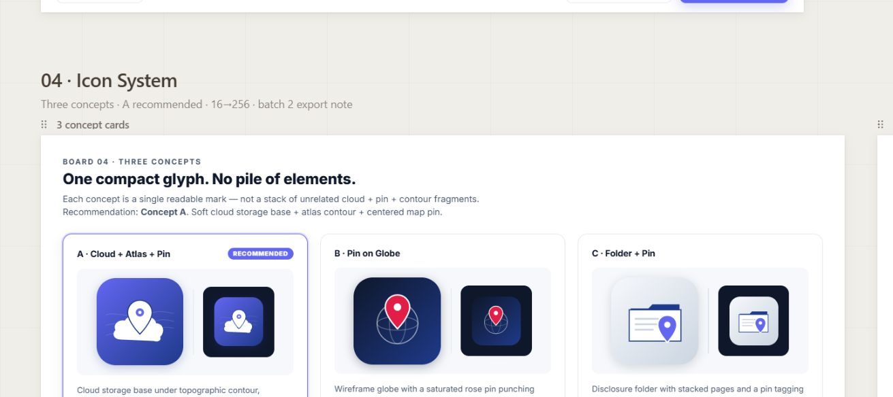

# UI Refresh Batch 1 — Claude Design Source

> Sprint 原要求使用 Figma 4 页源稿；本机 Figma Starter plan 只能创建 3 pages。用户在 2026-05-24 明确改为使用 Claude Design：`https://claude.ai/design`。因此本文件保留 sprint 约定文件名，实际设计源为 Claude Design 项目。

## Design Link

- Claude Design project: <https://claude.ai/design/p/0e07fab2-bc87-4182-b7fc-259fc05884f5?file=Filings+Atlas+Design+Review.html>
- Deliverable: `Filings Atlas Design Review.html`
- Structure: one Claude Design canvas with five sections:
  - `00 Overview`
  - `01 Current Audit`
  - `02 Design System`
  - `03 Main Workbench`
  - `04 Icon System`

## Screenshots

### 01 Current Audit

### 02 Design System

### 03 Main Workbench

### 04 Icon System

## Batch 1 Output Summary

- Current Audit includes recreated zh/en v0.9 baselines, the five existing design token selectors, legacy `ExchangeChip` retirement rationale, and the old accent map.
- Design System defines cloud-gray workbench colors, typography, shape/shadow/status tokens, map visual rules, and the full MarketPin color proposal.
- Main Workbench includes 1120x806 and 960x680 baselines, preserving the workbench flow and all existing business entries.
- Icon System includes three cloud map-pin concepts, a recommended final direction, and 16/32/48/64/128/256 size previews.

Claude Design noted that the uploaded current screenshots rendered with missing CJK fonts in its canvas, so it recreated readable CN/EN audit baselines from the supplied screenshots and prompt instead of embedding the broken originals. The original local screenshots are retained in `docs/plans/ui_refresh_current_audit/`.

## MarketPin Palette Proposal

| Market | Hex | Rationale |
|---|---:|---|
| UK | `#1E3A8A` | Cool navy for western-market block |
| US | `#0891B2` | Cool cyan, distinguishable from UK navy |
| A 股 | `#E11D48` | Locked rose-600; Chinese market red semantic |
| HK | `#F97316` | Warm orange |
| TW | `#F59E0B` | Warm amber |
| KR | `#C026D3` | Warm fuchsia, separated from orange/red |
| JP | `#DC2626` | Warm red |
| SG | `#A16207` | Warm ochre |

Order is locked as `UK / US || A 股 / HK / TW / KR / JP / SG`.

## Checkpoint A Self-Check

1. Mixed workbench style: passed. Atlas identity limited to logo, titlebar contour, and MarketPin route dots.
2. No full-screen map background: passed.
3. No market-to-market flight/route lines: passed.
4. 960x680 remains dense and usable: passed.
5. MarketPin is map-pin shaped, not rectangular chip: passed.
6. MarketPin layout is horizontal 8 pins, not a 2D map: passed.
7. MarketPin order is `UK / US || A 股 / HK / TW / KR / JP / SG`: passed.
8. Color split is 2 cool blues + 6 warm Asian colors, A-share `#E11D48`: passed.
9. Small-pin color distinguishability: passed in design preview; reviewer should still inspect visually.
10. Current Audit includes zh/en baseline plus five token annotations: passed, with recreated readable baselines.
11. Design System includes color / typography / shape / status / shadow tokens: passed.
12. v0.9 token replacement strategy is clear: passed; five objectName selectors remain functional, eight market accents replace v0.9 palette.
13. Icon System includes three concepts and a final direction: passed.
14. 16px recognizability check exists in Icon System: passed.

## Notes For Reviewer

- This is not a Figma source file. It is a Claude Design source project, per user override after Figma page-limit failure.
- The project contains an extra `00 Overview` section in addition to the four required review sections.
- Claude Design generated editable JSX files split by board under its internal `boards/` folder.
